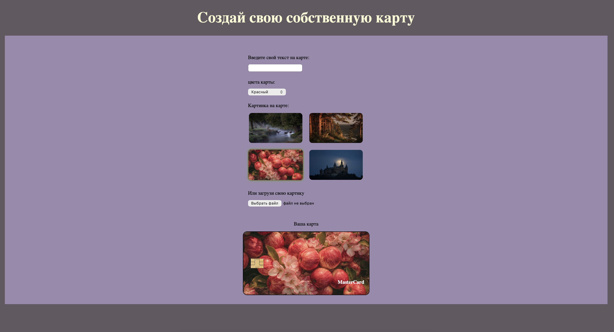

Учебный проект интерактивного сайта, который позволяет в реальном времени создавать свой дизайн банковской карты. Весь функционал реализован на чистом JavaScript.

🚀 Что умеет сайт:
- Живой ввод текста: Текст из поля ввода мгновенно отображается по центру карты.
  
- Динамические фоны: Можно выбрать цвет карты из списка или установить одну из готовых фоновых картинок.

- Загрузка своего фото: Реализована возможность загрузить любое изображение с компьютера и установить его фоном.

- Умный цвет текста: Шрифт автоматически меняется (черный/белый) в зависимости от выбранного фона, чтобы текст оставался читаемым.

- Фиксация элементов: Логотип MasterCard и игровой «чип» всегда остаются на своих местах и не мешают вводу текста.

🛠 Технологии:

HTML5:
Семантическая верстка, работа с формами (radio, file, select).

CSS3:
Flexbox Layout: Использование flex-direction: column и margin: auto для точного позиционирования текста и логотипа без использования absolute.
Background Management: Настройка многослойных фонов и позиционирование фоновых изображений.

JavaScript (Vanilla JS):

Манипуляция DOM-деревом (createElement, append).
Обработка событий (input, change).
Метод URL.createObjectURL для мгновенного предпросмотра загруженных файлов.

📦 Как посмотреть проект:
Склонируйте репозиторий или скачайте архив.
Откройте файл index.html в любом современном браузере.
Или перейдите по ссылке: [https://karinakit.github.io/card-customizer/]
📸 Как это выглядит: 

💡 Чему я научилась: 

- Связывать элементы формы с визуальным отображением на странице без перезагрузки.

- Работать с приоритетами в CSS (фон против цвета, слои изображений).

- Верстать сложные блоки с помощью Flexbox, избегая жесткого позиционирования.
